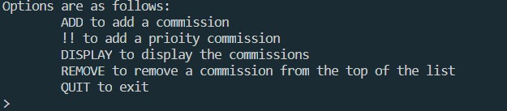
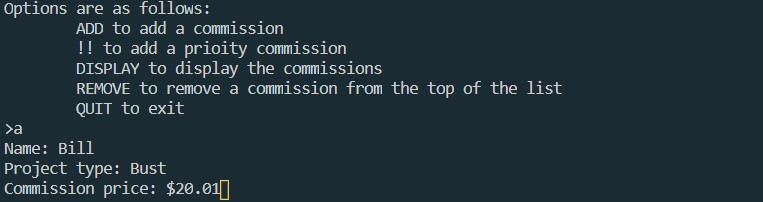
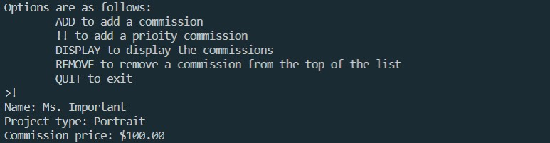
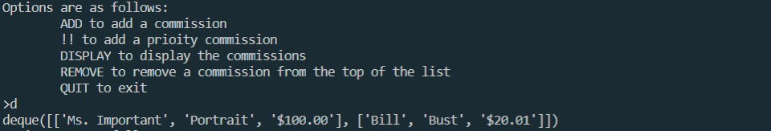
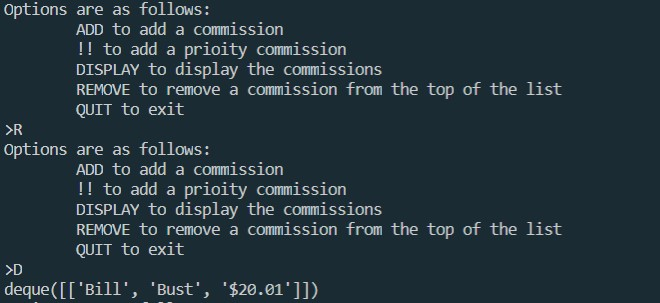

# This program uses Python 3.8.6

This is a concept for, once again, a future project of mine. My wife does art commissions, and in the near future, I will be working on her website and some tools to assist her in her business. This is a program that sets up a queue of art commissions with their name, project, and price charged. It was also a good excuse to use some python data structures (a deque in this case).

## Execution

To run the program `commission_queue.py`

You may open with [Python 3.8.6](https://www.python.org/) with your development envornment of choice. I shall use Visual Studio Code (VS Code) as that is what I'm familar with and prefer using.

1. Make sure that [Python 3.8.6](https://www.python.org/) is installed and set up with your development envornment. VS Code  will suggest a python extension if Python is already installed. 

2. Set up a virtual envornment via the teminal (VS Code). This can be done via the following command "py -m venv venv" wich will make a copy of the current version of Python being used for the hello world program.

3. Run the program. this can be done by pressing  F5 or Ctrl+F5 to run without debugging.

4. The program will open with this result displayed above, and will loop until told otherwise. From here, you may use the following options:
    1. ADD (or A) will prompt you to give a name, project type, and the commission price. These are all treated as strings. This will add the information to the back of the queue.
    
    2. !! (or !) does the same but prioritizes the commission, pushing to the front of the queue instead of the back.
    
    3. DISPLAY (or D) will show the contents of the queue in the following manner. 
    
    4. REMOVE (or R) will remove the top of the deque. If the queue is empty and the remove funtionis called, the program will exit. 
    
    5. QUIT (or Q) exits the loop and ends the program.

#### There you have it, possibly the most practical program I wrote so far